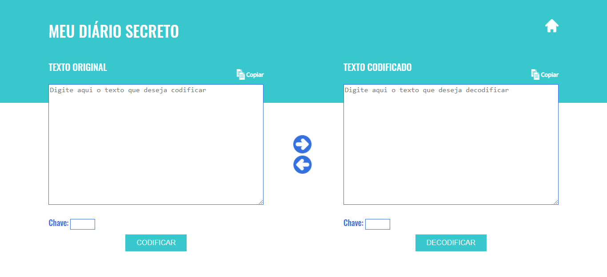

# Meu Diário Secreto

O **Meu Diário Secreto** é uma aplicação web que permite ao usuário manter um diário pessoal encriptado, uma vez que poderá fazer seus registros e codificar seus conteúdos, para que não sejam compreensíveis por outras pessoas. A qualquer momento, o conteúdo do texto original poderá ser acessado por meio da ferramenta de decodificação.
## Índice

* [1. Proposta do projeto](#1-proposta-do-projeto)
* [2. Tema](#2-tema)
* [3. Usuários](#3-usuários)
* [4. UX e UI](#4-ux-e-ui)
* [5. Conteúdos aprendidos](#2-conteúdos-aprendidos)

***
## 1. Proposta do projeto

Primeiro projeto proposto pelo bootcamp da [Laboratória](https://www.laboratoria.la/br).
Consiste em uma aplicação web (_WebApp_), em que o usuário poderá cifrar e decifrar um texto indicando a chave de deslocamento (offset).

A técnica de criptografia utilizada é a **Cifra de César**, uma cifra de substituição na qual cada letra de um texto a ser criptografado é substituída por outra letra, presente no alfabeto porém deslocada um certo número de posições à esquerda ou à direita.

## 2. Tema 
A escrita é um dos meios mais eficazes para extravazar os sentimentos, colocar os pensamentos no lugar e traçar metas para o futuro. É uma forma de terapia pela expressão, que usa o ato de escrever e processar a palavra escrita como tratamento terapêutico. 

A proposta do **Meu Diário Secreto** é possibilitar esse desabafo e permitir ao usuário que mantenha o sigilo do conteúdo de seus registros.

## 3. Usuários

Pessoas que desejam expressar através da escrita seus pensamentos, ideias, desabafar, falar sobre sentimentos e acontecimentos, mas querem  manter o sigilo do conteúdo de seus textos.

## 4. UX e UI

Primeiramente, foi definido que o layout da página principal de encriptação e desencriptaçao contaria com duas caixas de textos:
1. A caixa da esquerda:
    - Na encriptação, receber uma mensagem (texto) para ser cifrada.
    - Na desencriptação, mostrar o resultado da mensagem decifrada.
    
2. A caixa da direita:
    - Na desencriptação, receber uma mensagem (texto) para ser decifrada.
    - Na encriptação,  mostrar o resultado da mensagem decifrada.

O primeiro protótipo da página principal foi feito por meio da ferramenta Figma:

A paleta de cores utilizada foi priorizando o azul e verde, que transmitem tranquilidade, harmonia e segurança.

Uma tela inicial foi acrescentada para falar sobre os benefícios e funcionamento da ferramenta. As imagens seguintes correspondem à interface final:

**Tela Inicial:**

**Tela de codificação e decodificação:**

## 5. Conteúdos aprendidos
### HTML e CSS

* Uso de HTML semântico.](https://developer.mozilla.org/pt-BR/docs/Glossario/Semantica#Sem%C3%A2ntica_em_HTML)
* Uso de seletores de CSS.

### DOM

*  Uso de seletores do DOM.
*  Manipular eventos do DOM.
*  [Manipulação dinâmica do DOM.](https://developer.mozilla.org/pt-BR/docs/DOM/Referencia_do_DOM/Introdu%C3%A7%C3%A3o)

### JavaScript

*  Manipulação de strings.
*  Uso de condicionais.
*  Uso de laços _(loops)_.
*  Uso de funções (parâmetros | argumentos | valor de retorno)
*  Declaração correta de variáveis (const & let)

### Testing

*  [Teste unitário.](https://jestjs.io/docs/pt-BR/getting-started)

### Estrutura do código e guia de estilo

*  Organizar e dividir o código em módulos (Modularização)
*  Uso de identificadores descritivos (Nomenclatura | Semântica)
*  Uso de linter (ESLINT)

### Git e GitHub

*  Uso de comandos de git (add | commit | pull | status | push)
*  Gerenciamento de repositorios de GitHub (clone | fork | gh-pages)

### UX

*  Desenhar a aplicação pensando e entendendo o usuário.
*  Criar protótipos para obter feedback e iterar.
*  Aplicar os princípios de desenho visual (contraste, alinhamento, hierarquia)
